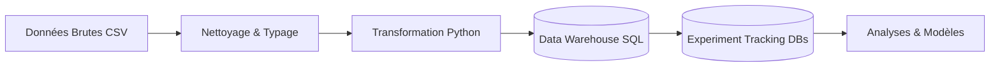
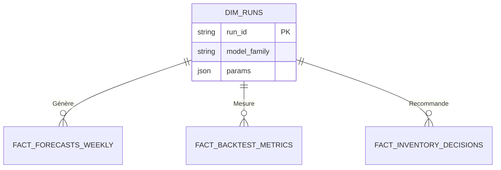

# Retail Demand Forecasting & Inventory Optimization Assistant

> **"Ne prédisez pas seulement les ventes. Optimisez les décisions."**

Ce projet est une solution complète d'intelligence artificielle appliquée à la grande distribution (Retail). Il dépasse le simple cadre de la prévision de ventes (Forecasting) pour fournir un outil d'aide à la décision pour l'optimisation des stocks (Inventory Optimization).

---

## 1. Contexte & Enjeux (Business Case)

### Le Défi : Le Dilemme du Stock
Dans la grande distribution, chaque responsable de magasin doit répondre chaque semaine à une question critique : **"Combien dois-je commander ?"**.
Cette décision est un équilibre précaire entre deux risques financiers majeurs :
1.  **La Rupture de Stock (Understock)** : Ventes perdues, clients insatisfaits, image de marque dégradée.
2.  **Le Surstock (Overstock)** : Trésorerie immobilisée, coûts de stockage, risques de perte (périssables) ou de démarque inconnue.

### L'Environnement : Corporación Favorita (Équateur)
Le projet se base sur les données réelles d'une grande chaîne de supermarchés en Équateur. Cet environnement présente des complexités spécifiques qui rendent les méthodes traditionnelles (moyennes mobiles) inefficaces :
*   **Volatilité promotionnelle** : Les promotions massives créent des pics de demande soudains.
*   **Calendrier complexe** : Jours fériés locaux (ville), régionaux (état) et nationaux, souvent décalés ("Ponts").
*   **Facteurs macro-économiques** : La sensibilité aux prix du pétrole (économie locale).
*   **Diversité des produits** : Des milliers de références, allant des produits de base (ventes stables) aux produits de niche (ventes intermittentes/rares).

### L'Objectif
Fournir un assistant capable de :
1.  Prévoir la demande hebdomadaire sur un horizon de **8 semaines**.
2.  Quantifier l'incertitude de cette prévision.
3.  Recommander une quantité de commande optimale basée sur les coûts économiques.

---

## 2. Architecture & Stratégie de Données (ETL)

La fiabilité des prévisions dépend avant tout de la qualité des données. Nous avons mis en place un pipeline ETL (Extract, Transform, Load) rigoureux.



### Transformation & Qualité (Python)
Nos scripts de traitement (`src/data/`) appliquent des règles métier strictes :
1.  **Grille Cartésienne** : Les données de ventes brutes ne contiennent que les transactions. Nous générons les lignes manquantes (Ventes = 0) pour que le modèle apprenne la distinction entre "Pas de vente" (Magasin fermé ?) et "Pas de demande".
2.  **Agrégation Hebdomadaire ISO** : Utilisation du standard **ISO 8601**.
3.  **Sortie Parquet** : Les données nettoyées et prêtes pour le ML sont stockées dans `data/processed/*.parquet` (fichiers légers et rapides).

### Suivi des Expériences (Experiment Tracking)
Les résultats des modèles sont stockés dans 3 bases SQLite modulaires (`data/experiments/`) :
1.  `forecasts.sqlite` : Prévisions probabilistes (P10, P50, P90) et registre des runs.
2.  `metrics.sqlite` : Erreurs (RMSE, MAE) et monitoring de drift.
3.  `decisions.sqlite` : Recommandations de commandes optimisées.



---

## 3. Stratégie de Modélisation (Intelligence Artificielle)

Nous adoptons une approche pragmatique : le "meilleur" modèle est celui qui est le plus robuste et utile.

### Approche "Baseline Hybride" (Smart Routing)

La "Baseline" du projet n'est pas un modèle unique (comme une simple moyenne), c'est une **Stratégie Hybride Intelligente** (Smart Routing).

Imaginez-la comme un **médecin de triage** aux urgences. Au lieu de donner le même médicament à tout le monde, elle examine d'abord le "patient" (le produit) puis décide du traitement.

Voici exactement ce qu'elle fait, étape par étape :

#### 1. Le Diagnostic (Analyse du Produit)
Pour chaque produit du magasin, la baseline calcule deux indicateurs vitaux sur son historique.

**ADI (Average Demand Interval) - La Fréquence**
*   *Formule* : $ADI = \frac{N}{Nz}$ (où $N$ est la durée totale et $Nz$ le nombre de semaines avec ventes > 0).
*   *Interprétation* : Est-ce qu'on en vend souvent (tous les jours, ADI $\approx$ 1) ou rarement (une fois par mois, ADI > 4) ?

**CV² (Coefficient of Variation Squared) - La Volatilité**
*   *Formule* : $CV^2 = \frac{\sigma^2}{\mu^2}$ (Variance divisée par la Moyenne au carré).
*   *Interprétation* : Quand on en vend, est-ce que c'est toujours la même quantité (stable, CV² faible) ou est-ce que ça varie énormément (nerveux, CV² élevé) ?

#### 2. La Classification (Matrice Syntetos-Boylan)
En fonction de ces deux chiffres, elle classe le produit dans une case de la matrice, utilisant les seuils théoriques validés ($ADI = 1.32$ et $CV^2 = 0.49$) :

*   **Smooth (Tranquille)** ($ADI < 1.32, CV^2 < 0.49$) : Ventes régulières et stables (ex: Lait, Pain).
*   **Erratic (Nerveux)** ($ADI < 1.32, CV^2 \ge 0.49$) : Ventes fréquentes mais quantités folles (ex: Promos flash).
*   **Intermittent** ($ADI \ge 1.32, CV^2 < 0.49$) : Ventes rares mais quantités stables.
*   **Lumpy (Grumuleux)** ($ADI \ge 1.32, CV^2 \ge 0.49$) : Ventes rares ET quantités folles (le pire cas).

#### 3. Le "Routing" (Le Choix du Modèle)
C'est là que la magie opère. Le code (`src/baselines/optimized.py`) applique automatiquement la meilleure formule pour chaque profil :

| Type de Produit | La Recette Appliquée | Pourquoi ce choix ? |
| :--- | :--- | :--- |
| **Produits Stables** (Smooth) | **Mix (70% Moyenne + 30% Saisonnier)** | On lisse le bruit tout en gardant une légère mémoire de la saisonnalité de l'année précédente. |
| **Produits Nerveux** (Erratic) | **Mix (50% Moyenne + 50% Saisonnier)** | La volatilité est forte : on fait plus confiance à la saisonnalité (historique) car la moyenne réagit trop lentement aux pics. |
| **Produits Rares** (Intermittent/Lumpy) | **Moyenne Mobile Robuste** | Inutile de chercher une saisonnalité sur des ventes rares. On assure le "minimum vital" pour éviter le surstockage. |

#### En résumé
La baseline ne cherche pas à être "intelligente" au sens IA/Deep Learning. Elle cherche à être **statistiquement robuste**. Elle évite les erreurs stupides :
*   Ne pas prédire de saisonnalité sur un produit qui ne se vend jamais.
*   Ne pas ignorer la tendance récente sur un produit qui décolle.

C'est cette stratégie de **"bon sens automatisé"** qui lui permet d'atteindre une erreur (**WAPE**) de seulement **8%**, ce qui est très difficile à battre même pour des algorithmes complexes.

---

## 4. Moteur de Décision (Inventory Optimization)

Une prévision ponctuelle (ex: "50 unités") est insuffisante pour gérer un stock car elle ne dit rien du risque.

### Prévision Probabiliste
Nos modèles génèrent des intervalles de confiance :
*   **P10 (Scénario Bas)** : On est sûr à 90% de vendre au moins ça.
*   **P50 (Médiane)** : Le scénario le plus probable.
*   **P90 (Scénario Haut)** : On a 10% de chance de vendre plus que ça (Pic de demande).

### Logique "Newsvendor" (Vendeur de Journaux)
La commande finale est calculée en fonction des critères économiques du magasin :
*   Si le coût de la rupture est élevé (Produit d'appel, marge forte) -> Le système cible un quantile élevé (ex: P80).
*   Si le coût de surstock est élevé (Produit frais, encombrant) -> Le système cible un quantile bas (ex: P40).

---

## 5. Guide Technique

### Prérequis
*   Python 3.8+
*   Pip

### Installation
```bash
git clone [URL_DU_REPO]
cd retail-demand-forecasting-assistant
pip install -r requirements.txt
```

### Téléchargement des Données
Ce projet utilise le dataset Kaggle **Store Sales - Time Series Forecasting**. Les données ne sont pas incluses dans le dépôt (trop volumineuses).

**Option 1 - Kaggle CLI (Recommandé)** :
```bash
pip install kaggle
kaggle competitions download -c store-sales-time-series-forecasting
unzip store-sales-time-series-forecasting.zip -d data/raw/
```

**Option 2 - Manuel** :
Télécharger depuis https://www.kaggle.com/competitions/store-sales-time-series-forecasting/data et placer les CSV dans `data/raw/`.

### Construction des Données (Pipeline)
Pour régénérer l'entrepôt de données depuis les sources brutes :
```bash
# 1. Traitement et Nettoyage (Génération des Parquet)
python scripts/preprocessing.py

# 2. Construction de la Base SQL (Tables et Relations)
python scripts/build_warehouse.py

# 3. Vérification de l'Intégrité (Audit Automatique)
python scripts/verify_warehouse_integrity.py
```

### Lancement de l'Application
Une interface Streamlit permet de visualiser l'état du système :
```bash
streamlit run app/Home.py
```

### Structure du Projet
*   `data/` : Stockage des données (Raw, Processed, Database).
*   `notes/` : Documentation détaillée du projet.
*   `scripts/` : Scripts d'orchestration (ETL, Build, Verify).
*   `sql/` : Modules SQL (Définition du schéma).
*   `src/` : Code source Python (Logique métier et algorithmes).

---

**Auteur** : Goua Beedi
**Projet** : Retail Demand Forecasting Assistant