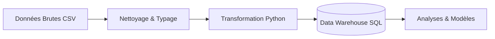
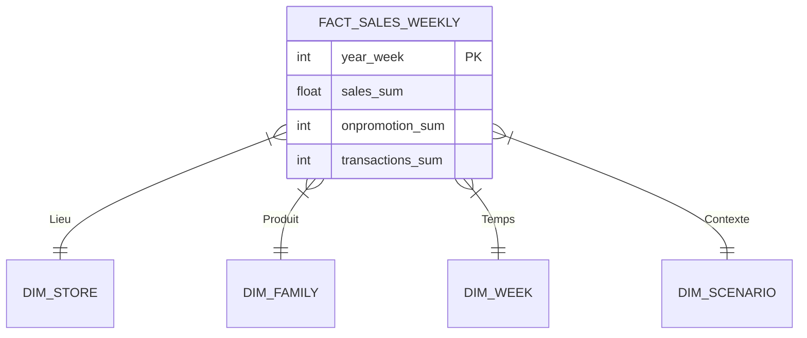

# Retail Demand Forecasting & Inventory Optimization Assistant

> **"Ne prédisez pas seulement les ventes. Optimisez les décisions."**

Ce projet est une solution complète d'intelligence artificielle appliquée à la grande distribution (Retail). Il dépasse le simple cadre de la prévision de ventes (Forecasting) pour fournir un outil d'aide à la décision pour l'optimisation des stocks (Inventory Optimization).

---

## 1. Contexte & Enjeux (Business Case)

### Le Défi : Le Dilemme du Stock
Dans la grande distribution, chaque responsable de magasin doit répondre chaque semaine à une question critique : **"Combien dois-je commander ?"**.
Cette décision est un équilibre précaire entre deux risques financiers majeurs :
1.  **La Rupture de Stock (Understock)** : Ventes perdues, clients insatisfaits, image de marque dégradée.
2.  **Le Surstock (Overstock)** : Trésorerie immobilisée, coûts de stockage, risques de perte (périssables) ou de démarque inconnue.

### L'Environnement : Corporación Favorita (Équateur)
Le projet se base sur les données réelles d'une grande chaîne de supermarchés en Équateur. Cet environnement présente des complexités spécifiques qui rendent les méthodes traditionnelles (moyennes mobiles) inefficaces :
*   **Volatilité promotionnelle** : Les promotions massives créent des pics de demande soudains.
*   **Calendrier complexe** : Jours fériés locaux (ville), régionaux (état) et nationaux, souvent décalés ("Ponts").
*   **Facteurs macro-économiques** : La sensibilité aux prix du pétrole (économie locale).
*   **Diversité des produits** : Des milliers de références, allant des produits de base (ventes stables) aux produits de niche (ventes intermittentes/rares).

### L'Objectif
Fournir un assistant capable de :
1.  Prévoir la demande hebdomadaire sur un horizon de **8 semaines**.
2.  Quantifier l'incertitude de cette prévision.
3.  Recommander une quantité de commande optimale basée sur les coûts économiques.

---

## 2. Architecture & Stratégie de Données (ETL)

La fiabilité des prévisions dépend avant tout de la qualité des données. Nous avons mis en place un pipeline ETL (Extract, Transform, Load) rigoureux.



### Transformation & Qualité (Python)
Nos scripts de traitement (`src/data/`) appliquent des règles métier strictes :
1.  **Grille Cartésienne** : Les données de ventes brutes ne contiennent que les transactions. Nous générons les lignes manquantes (Ventes = 0) pour que le modèle apprenne la distinction entre "Pas de vente" (Magasin fermé ?) et "Pas de demande".
2.  **Agrégation Hebdomadaire ISO** : Pour éviter les chevauchements temporels, nous utilisons le standard **ISO 8601** strict (Semaines du Lundi au Dimanche).
3.  **Gestion du Futur (Anti-Leakage)** : Les semaines futures (Test Set) sont strictement isolées. Leurs ventes sont marquées comme `NULL` (et non 0) pour éviter de biaiser l'apprentissage.

### Entrepôt de Données (Data Warehouse)
Les données sont stockées dans une base SQLite modélisée en **Schéma en Étoile (Star Schema)**, optimisé pour l'analyse décisionnelle.



---

## 3. Stratégie de Modélisation (Intelligence Artificielle)

Nous adoptons une approche pragmatique : le "meilleur" modèle est celui qui est le plus robuste et utile.

### Approche Multi-Modèles
Nous ne nous reposons pas sur un algorithme unique. Le système met en compétition plusieurs approches :
1.  **Baselines Statistiques** :
    *   *Seasonal Naive* : Réplique la saisonnalité de l'année précédente. Sert de "plancher" de performance.
    *   *ETS / Theta* : Modèles robustes pour capturer la tendance et la saisonnalité.
2.  **Machine Learning (Gradient Boosting)** :
    *   Algorithmes : XGBoost, LightGBM, CatBoost.
    *   Force : Capable d'intégrer des variables exogènes (Impact d'une promotion, Prix du pétrole, Jour férié local).
3.  **Croston-SBA** : Spécifique pour les produits à ventes intermittentes (beaucoup de zéros).

### Routing Intelligent ("Smart Baseline")
Le système analyse le profil de chaque série temporelle (Régulière vs Intermittente) pour router automatiquement vers le modèle le plus adapté.

### Validation Réaliste (Rolling Origin Backtest)
Nous ne faisons pas un simple split Train/Test aléatoire. Nous simulons le passage du temps réel :
1.  Entraînement jusqu'à la semaine W.
2.  Prévision des semaines W+1 à W+8.
3.  Comparaison avec la réalité.
4.  Avance à la semaine W+1 et répétition.

---

## 4. Moteur de Décision (Inventory Optimization)

Une prévision ponctuelle (ex: "50 unités") est insuffisante pour gérer un stock car elle ne dit rien du risque.

### Prévision Probabiliste
Nos modèles génèrent des intervalles de confiance :
*   **P10 (Scénario Bas)** : On est sûr à 90% de vendre au moins ça.
*   **P50 (Médiane)** : Le scénario le plus probable.
*   **P90 (Scénario Haut)** : On a 10% de chance de vendre plus que ça (Pic de demande).

### Logique "Newsvendor" (Vendeur de Journaux)
La commande finale est calculée en fonction des critères économiques du magasin :
*   Si le coût de la rupture est élevé (Produit d'appel, marge forte) -> Le système cible un quantile élevé (ex: P80).
*   Si le coût de surstock est élevé (Produit frais, encombrant) -> Le système cible un quantile bas (ex: P40).

---

## 5. Guide Technique

### Prérequis
*   Python 3.8+
*   Pip

### Installation
```bash
git clone [URL_DU_REPO]
cd retail-demand-forecasting-assistant
pip install -r requirements.txt
```

### Construction des Données (Pipeline)
Pour régénérer l'entrepôt de données depuis les sources brutes :
```bash
# 1. Traitement et Nettoyage (Génération des Parquet)
python scripts/preprocessing.py

# 2. Construction de la Base SQL (Tables et Relations)
python scripts/build_warehouse.py

# 3. Vérification de l'Intégrité (Audit Automatique)
python scripts/verify_warehouse_integrity.py
```

### Lancement de l'Application
Une interface Streamlit permet de visualiser l'état du système :
```bash
streamlit run app/Home.py
```

### Structure du Projet
*   `data/` : Stockage des données (Raw, Processed, Database).
*   `notes/` : Documentation détaillée du projet.
*   `scripts/` : Scripts d'orchestration (ETL, Build, Verify).
*   `sql/` : Modules SQL (Définition du schéma).
*   `src/` : Code source Python (Logique métier et algorithmes).

---

**Auteur** : Goua Beedi
**Projet** : Retail Demand Forecasting Assistant