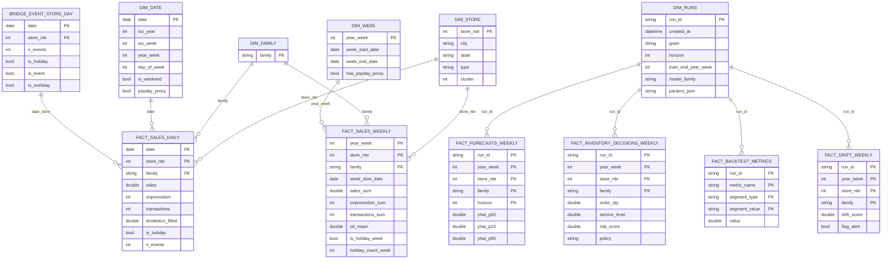

OK, je reprends le **schéma complet** “de bout en bout”, pensé pour être **ta base SQL** pour toute la suite (audit, features, backtests, prévisions, décisions stock, monitoring), en gardant **weekly comme vérité métier** mais **daily disponible** pour drill-down / debug.

Je te donne :

* **couches (raw → staging → mart)**
* **tables (facts/dims/bridges)**
* **PK/FK + grain**
* **comment gérer holidays sans explosion de lignes**
* **vues SQL utiles**
* **ce que tu dois produire à partir de tes fichiers actuels**

---

# 0) L’idée : 3 couches (simple mais pro)

## A) `raw` (archive)

Tes fichiers Kaggle inchangés (CSV/parquet). Tu ne requêtes presque jamais dessus.

## B) `staging` (nettoyé / typé / sans logique métier)

On charge, on type, on dédoublonne, on standardise.
But : éviter les bugs.

## C) `mart` (modèle analytique)

Star schema + tables “runs/forecasts/decisions/metrics”.
C’est **ça** que tu interroges pour tout le projet.

---

# 1) Staging : tables à créer (fidèles aux fichiers)

## `stg_train_daily`

**Grain** : (date, store_nbr, family)
**PK** : date + store_nbr + family
Colonnes :

* `date` (DATE)
* `store_nbr` (INT)
* `family` (TEXT)
* `sales` (DOUBLE)
* `onpromotion` (INT)
* `id` (INT) si présent

## `stg_test_daily`

Même grain, pas de sales :

* `date`, `store_nbr`, `family`, `onpromotion`, `id`

## `stg_transactions_daily`

**Grain** : (date, store_nbr)

* `date`, `store_nbr`, `transactions`

## `stg_oil_daily`

**Grain** : date

* `date`, `dcoilwtico`

- on garde `dcoilwtico_filled` (ffill/bfill) au staging (sinon tu te tires une balle dans le pied plus tard)

## `stg_holidays_events`

**Grain** : une ligne = un event

* `date`, `type`, `locale`, `locale_name`, `description`, `transferred`

## `stg_stores`

**Grain** : store_nbr

* `store_nbr`, `city`, `state`, `type`, `cluster`

---

# 2) Mart : dimensions (DIMS)

## A) `dim_store`

PK : `store_nbr`
Colonnes : `city`, `state`, `type`, `cluster`

## B) `dim_family`

PK : `family`
Colonnes minimales :

* `family`
  Optionnel (plus tard) :
* `family_group` (si tu regroupes)
* `is_intermittent_default` (calculé après audit)

## C) `dim_date` (daily)

PK : `date`
Colonnes :

* `year`, `month`, `day`
* `day_of_week` (0–6)
* `is_weekend`
* `iso_year`, `iso_week`
* `year_week` (iso_year*100 + iso_week)
* `is_month_end`, `is_month_start`
* `payday_proxy` (day=15 OR month_end)

👉 Tu as déjà `dim_calendar.parquet` : parfait. Assure-toi qu’il contient **year_week**.

## D) `dim_week`

PK : `year_week`
Colonnes :

* `iso_year`, `iso_week`
* `week_start_date` (lundi)
* `week_end_date` (dimanche)
* `month_of_week_start`, `quarter`
* `has_payday_proxy` (si la semaine contient le 15 ou fin de mois)
* `n_days_present` (utile si semaine partielle)

> `dim_week` se dérive à 100% de `dim_date`.

---

# 3) Mart : holidays (le point critique)

**Problème** : `holidays_events` a plusieurs lignes par date → si tu merges directement, tu dupliques tes faits.

## table agrégée par date + store

### `bridge_event_store_day`

**Grain** : (date, store_nbr)
PK : date + store_nbr
Colonnes :

* `n_events` (INT)
* `is_holiday` (0/1)
* `is_event` (0/1)
* `is_workday` (0/1)
* `is_transfer` (0/1)
* `event_types_set` (optionnel, string concat)
* `descriptions_set` (optionnel)

**Règles d’expansion** :

* locale=National → tous les stores
* locale=Regional → stores du même `state`
* locale=Local → stores de la même `city`
* `transferred=true` → généralement tu ne le comptes pas comme “holiday réel” (ou tu l’isoles)

✅ Avantage : tu peux faire des features *store-aware* (local/régional), sans explosion.

---

# 4) Mart : facts (FACTS)

## A) `fact_sales_daily`

**Grain** : (date, store_nbr, family)
PK : date + store_nbr + family
Colonnes :

* `sales` (NULL pour test/futur)
* `onpromotion`
* `transactions` (jointure via date+store)
* `dcoilwtico_filled` (jointure via date)
* `event flags` (jointure via bridge_event_store_day ou dim_events_day)
* (optionnel) `data_split` = train/test/future

👉 Ça correspond à ton `daily_canon.parquet`.

## B) `fact_sales_weekly`  ✅ (ta “Source de Vérité” métier)

**Grain** : (year_week, store_nbr, family)
PK : year_week + store_nbr + family
Colonnes :

* `week_start_date`
* `sales_sum` (NULL sur futur)
* `onpromotion_sum` (ou mean)
* `transactions_sum`
* `oil_mean`
* `is_holiday_week` (max)
* `holiday_count_week` (sum)
* `is_event_week` (max)
* `event_count_week` (sum)
* `has_payday_proxy_week` (max)

👉 Ça correspond à ton `weekly_canon.parquet`.

**Règle d’or** : `sales_sum` doit être **NULL** sur les semaines futures, pas 0.

---

# 5) Modélisation / traçabilité (indispensable pour un projet “portfolio pro”)

## A) `dim_runs`

PK : `run_id` (UUID/string)
Colonnes :

* `created_at`
* `grain` (daily/weekly)
* `horizon` (8 en weekly)
* `train_end_year_week`
* `model_family` (baseline/gbm/etc.)
* `params_json` (texte)
* `code_version` (git commit optionnel)
* `data_version` (optionnel)

## B) `fact_forecasts_weekly`

PK : run_id + year_week + store_nbr + family + horizon
Colonnes :

* `yhat_p50`
* `yhat_p10`, `yhat_p90`
* `model_name`

## C) `fact_inventory_decisions_weekly`

PK : run_id + year_week + store_nbr + family
Colonnes :

* `order_qty`
* `policy` (newsvendor_pXX, minmax, etc.)
* `service_level`
* `risk_score` (priorisation)
* `reason_code` (promo/holiday/trend)

## D) `fact_backtest_metrics`

PK : run_id + metric + segment_type + segment_value
Colonnes :

* `value`
* `window_start_week`, `window_end_week`
* `n_obs`

## E) `fact_drift_weekly` (simple mais puissant)

PK : run_id + year_week + store_nbr + family
Colonnes :

* `drift_score`
* `promo_shift`
* `sales_level_shift`
* `flag_alert` (0/1)

---

# 6) Relations (PK/FK) : liens clairs

* `fact_sales_weekly.store_nbr` → `dim_store.store_nbr`

* `fact_sales_weekly.family` → `dim_family.family`

* `fact_sales_weekly.year_week` → `dim_week.year_week`

* `fact_sales_daily.date` → `dim_date.date`

* `fact_sales_daily.store_nbr` → `dim_store.store_nbr`

* `fact_sales_daily.family` → `dim_family.family`

* `bridge_event_store_day.date` → `dim_date.date`

* `bridge_event_store_day.store_nbr` → `dim_store.store_nbr`

* `fact_forecasts_weekly.run_id` → `dim_runs.run_id`

* `fact_inventory_decisions_weekly.run_id` → `dim_runs.run_id`

* `fact_backtest_metrics.run_id` → `dim_runs.run_id`

---

# 7) Schéma ER (version complète)

---

# 8) Concret : avec tes fichiers actuels, tu dois viser quoi ?

Tu as déjà :

* `weekly_canon.parquet` → alimente `fact_sales_weekly`
* `daily_canon.parquet` → alimente `fact_sales_daily` (backup + debug)
* `dim_calendar.parquet` → alimente `dim_date` et dérive `dim_week`

Ce qu’il te manque (si tu veux complet) :

* `dim_store` (simple depuis stores.csv)
* `dim_family` (liste distincte)
* **bridge_event_store_day** (ou au moins dim_events_day)
  ➡️ c’est la pièce la plus importante à ajouter si tu veux un SQL propre.

---

# 9) Réponse directe à ton intention : “complet pour la suite”

Oui, on peut faire un système complet avec :

* `fact_sales_weekly` + `dim_week` + `dim_store` + `dim_family` + `bridge_event_store_day`
* puis `dim_runs` + `fact_forecasts_weekly` + `fact_inventory_decisions_weekly` + `fact_backtest_metrics`

C’est exactement ce qu’il faut pour :

* backtesting rolling-origin (SQL-friendly)
* top décisions
* suivi des performances
* monitoring/drift basique
* reproductibilité (run_id)

