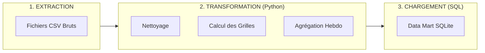
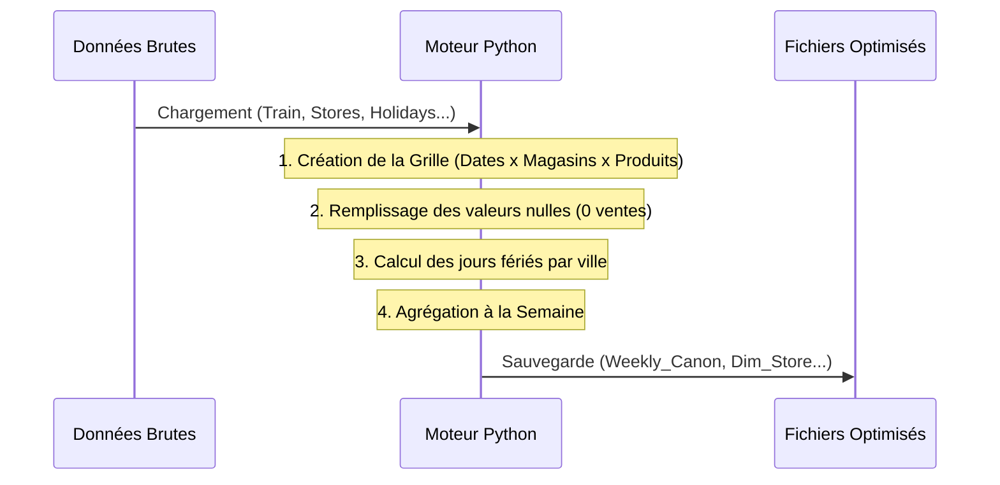
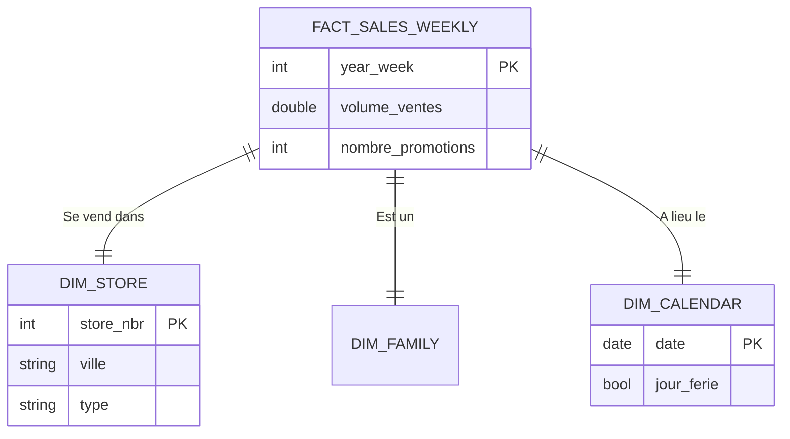
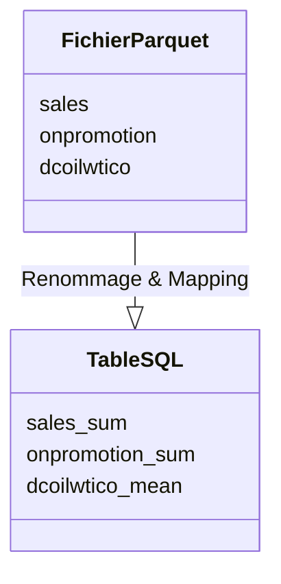

# Ingénierie des Données : Du Brut à la Décision

> "Une IA de prévision ne vaut que ce que valent ses données."

Ce document détaille l'architecture technique du pipeline de données mis en place pour le projet d'Assistant Retail. Il explique comment nous transformons des fichiers hétérogènes en un système décisionnel fiable.

---

## 1. Vision Macroscopique : Le Pipeline ETL

Nous avons implémenté un pipeline classique **ETL** (Extract, Transform, Load).

---

## 2. Transformation : La Préparation des Données

Cette étape est gérée par nos scripts Python (`src/data/`). C'est ici que les règles métier sont appliquées.

### Flux de Transformation
Le script `scripts/preprocessing.py` orchestre le flux suivant :

### Concepts Clés du Traitement

#### A. La Grille Cartésienne (`build_daily_grid`)
Les fichiers sources ne contiennent que les transactions effectives. Si un produit ne se vend pas, il n'y a pas de ligne.
**Action** : Nous générons artificiellement toutes les combinaisons possibles (Date / Magasin / Produit).
**Résultat** : Le modèle peut apprendre la différence entre "Pas de stock" et "Pas de demande".

#### B. La Gestion des Jours Fériés (`process_holidays`)
L'Équateur a des jours fériés complexes (locaux, régionaux, nationaux).
**Action** : Nous croisons la localisation de chaque magasin avec la portée de chaque événement.
**Résultat** : Une table précise (`bridge_event_store_day`) qui indique si le magasin X est fermé le jour Y.

---

## 3. Chargement SQL : Construction de l'Entrepôt

C'est l'étape finale où nous structurons les données pour l'analyse et la modélisation. Nous utilisons **SQLite** pour sa portabilité et sa fiabilité.

### Phase A : L'Architecture (Le Schéma)

Nous utilisons un **Schéma en Étoile**. Cela sépare clairement les mesures quantitatives (Faits) des axes d'analyse (Dimensions).

*   **Table de Faits (`FACT_`)** : Contient les métriques (Ventes, Promotions). Elle est optimisée pour les calculs.
*   **Table de Dimensions (`DIM_`)** : Contient le contexte (Nom de la ville, Catégorie de produit).

### Phase B : Le Processus de Chargement

Le script `scripts/build_warehouse.py` automatise la création de la base de données. Voici comment il procède, étape par étape.

#### Étape 1 : Initialisation de la Structure (Modulaire)
Le script scanne le dossier `sql/` et exécute les modules de définition dans l'ordre alphanumérique :
1.  `00_cleanup.sql` (RAZ)
2.  `01_dimensions.sql`
3.  `02_bridge.sql`
4.  `03_facts.sql`
5.  `04_mart.sql`

#### Étape 2 : Ingestion des Données (Mapping)
C'est l'étape délicate. Les fichiers Parquet (Python) doivent correspondre exactement aux tables SQL. Le script effectue un "Mapping" (correspondance de colonnes) avant d'insérer.

*Exemple pour les Ventes Hebdomadaires :*

#### Étape 3 : Vérification (Audit)
Après le chargement, le script compte les lignes pour garantir qu'aucune donnée n'a été perdue en route.
*   **Entrée** : 434,808 lignes dans le fichier Parquet.
*   **Sortie** : 434,808 lignes dans la table `fact_sales_weekly`.
*   **Statut** : Intégrité Validée.

---

## 4. Robustesse & Validations : Le "Data Quality" (V2)

Suite aux retours et analyses, nous avons durci le pipeline pour garantir une fiabilité absolue pour la modélisation.

### A. L'Horloge ISO (Semaines strictes)
Pour éviter tout chevauchement (Overlaps) qui fausserait l'apprentissage temporel :
*   Le calendrier utilise le standard **ISO 8601** strict (`iso_year`, `iso_week`) aligné sur les Lundis.
*   **Résultat** : Des blocs de 7 jours parfaitement contigus. Un script de vérification confirme que l'écart entre chaque semaine est de **exactement 7.0 jours** (`Gap = 7.0`).

### B. "Anti-Fuite" vers le Futur (Data Leakage)
Le jeu de données inclut une période `TEST` (le futur à prédire).
*   **Problème corrigé** : Ces semaines avaient initialement des Ventes = 0, ce qui trompait les modèles (leur faisant croire à une chute brutale de la demande).
*   **Solution** : Les ventes futures sont désormais marquées comme **NULL** (Inconnues) dans `fact_sales_weekly`.
*   **Flagging** : Une colonne `is_future` (0 ou 1) permet d'isoler explicitement ces périodes.

### C. Vérification Automatique
Un "Gardien" (`scripts/verify_warehouse_integrity.py`) valide désormais mathématiquement la base après chaque reconstruction :
1.  Zéro chevauchement de semaines.
2.  Zéro fuite de données futures (Sales IS NULL si Future=1).

---

## Conclusion Technique

Cette architecture en trois temps (Python -> Parquet -> SQL) offre plusieurs avantages majeurs :

1.  **Traçabilité** : Chaque étape produit un fichier intermédiaire vérifiable.
2.  **Performance** : Les calculs lourds (Jointures, Agrégations) sont faits une seule fois en Python. Le SQL ne sert qu'à la lecture rapide.
3.  **Extensibilité** : Si nous voulons ajouter une nouvelle source de données (ex: Météo), il suffit d'ajouter une table de Dimension et une colonne dans la table de Faits.

Le socle de données est désormais stabilisé et prêt pour l'intégration des modèles de Machine Learning.
